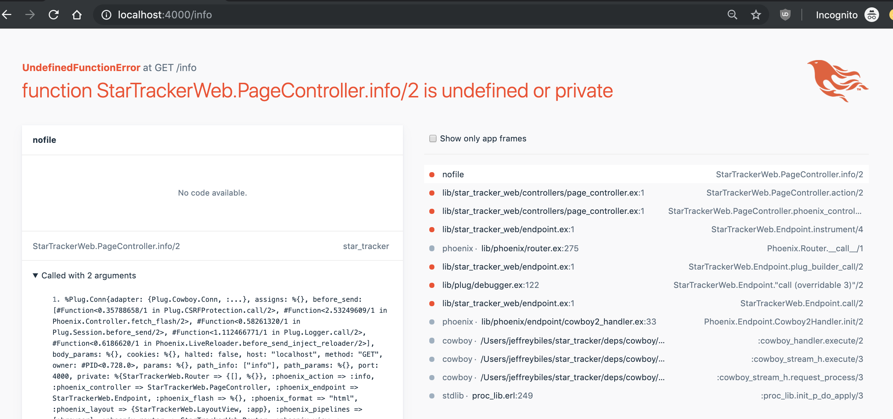
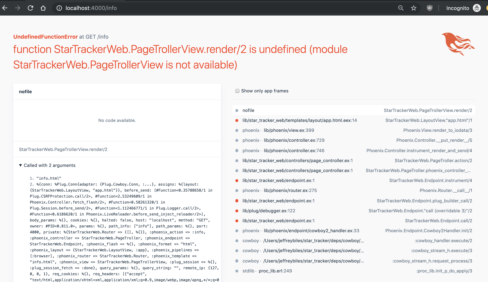
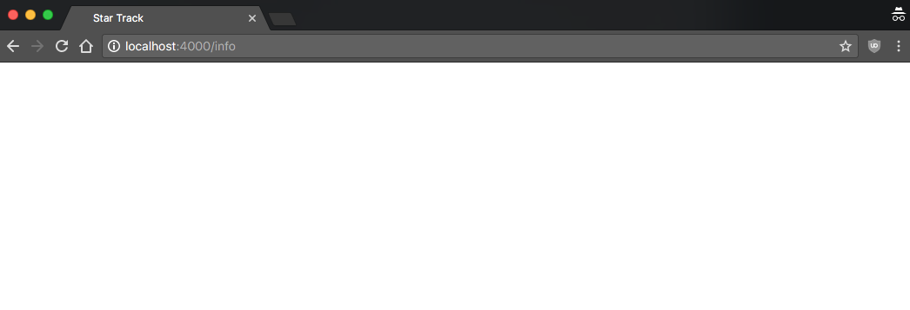

# A New Page

In this chapter we're going to add our first custom Route- an Info page- giving us practice in the basics of html we learned last time, as well as our first look at a more full cycle of a request in Phoenix.

Here's what it will look like at the end of this chapter:


But this is what it would look like right now if you tried to visit `localhost:4000/info`:


The error message is "no route found for GET /info (StarTracker.Router)".

## The Router

Let's crack open our Router file, in `web/router.ex`, and start exploring.  It should look like this:

<!-- web/router.ex -->
```elixir
defmodule StarTracker.Router do
  use StarTracker.Web, :router

  pipeline :browser do
    plug :accepts, ["html"]
    plug :fetch_session
    plug :fetch_flash
    plug :protect_from_forgery
    plug :put_secure_browser_headers
  end

  pipeline :api do
    plug :accepts, ["json"]
  end

  scope "/", StarTracker do
    pipe_through :browser # Use the default browser stack

    get "/", PageController, :index
  end

  # Other scopes may use custom stacks.
  # scope "/api", StarTracker do
  #   pipe_through :api
  # end
end
```

We'll go over this line by line before making our edit.

## The Router Name

First, notice the module name- `StarTracker.Router`.  Many many module names in our app will start with `StarTracker`- it's a good indication that what we're using is local to our Phoenix app.  Then the second part- `Router` tells us the specific usage of this module.  

Both parts of the name are very important, and Phoenix will freak out if you change either one.  Try it!  Change it to `StarTracker.Diverter` or something and Phoenix will immediately start asking where `StarTracker.Router` went.


If you start getting messages like that ("Module StarTracker.X is not available") the most probably cause is that you misnamed something.

Let's change it back and then move on.

## Macros

The next line is `use StarTracker.Web, :router`.  We'll go into detail in the next chapter on how that works, but for now just know that that's how we get the `pipeline`, `plug`, `scope`, `pipe_through`, and `get` macros used later in the file.

---

> Technobabble: Macros

> Macros are a cool advanced Elixir feature that give us more power and syntactical freedom than regular functions and let us define a DSL (Domain Specific Language). (TODO: Is this description accurate and sufficient?)

> While we won't be defining our own Macros in this book, we'll be taking advantage of lots of them that are built into Phoenix- the items from `StarTracker.Web, :router` are just the first.

> I'd encourage you to research Macros for yourself.  (TODO: Investigate the next sentence to make sure it's true (read the book)) A good resource for this is [Metaprogramming Elixir](https://pragprog.com/book/cmelixir/metaprogramming-elixir) by Chris McCord (the creator of the Phoenix framework).  It's a short but advanced book- if you had any trouble with chapters 2-4, I recommend waiting until the end of this book, and possibly reading [another Intro to Elixir book](https://pragprog.com/book/elixir13/programming-elixir-1-3) first.

---

The first of those macros is `pipeline`.  We define two of them: `browser` and `api`.  Each has a series of `plugs`- a set of stacked instructions to run on each request (we'll go over plugs later in the book)- that provide helpful functionality for the specific type of request we're running.

## The Routes Themselves

Next we see the following:

```elixir
scope "/", StarTracker do
  pipe_through :browser # Use the default browser stack

  get "/", PageController, :index
end
```

The `scope` macro takes two arguments and a block.

The first argument is the base url- `/` here, so effectively nil- and the second argument is the app that will serve in this scope- `StarTracker`.  Everything else in the scope will be prefixed with that (for example, `PageController` will actually be `StarTracker.PageController`).  The block is everything between `do` and `end`, and where we use `pipe_through` and `get`.  

`pipe_through :browser` says that within this scope, we'll be using the `browser` pipeline that we defined earlier.

`get` takes 3 arguments- the url, the controller, and the function.  Here the url is `/`, the controller is `PageController`, and the function is `:index`.  What this means is that if a GET request is sent to the url `/`, then we'll respond with the index function on PageController.

---

> **Previously on: Request Types**

> GET is only one of several types of requests available.  It's the most common, but other common types include POST, PUT, and DELETE.

> Generally GET is used when you want information from the server but aren't requesting that the server make any changes.

> We'll cover the other request types later when we start using them.

---

## Our New Route

Let's define our own route now- `info`.  It'll be a `get` request, since we don't need the server to make any changes.  We'll want the url to be `/info`, we can re-use the `PageController`, and we'll call our function `:info`.

```elixir
scope "/", StarTracker do
  pipe_through :browser # Use the default browser stack

  get "/", PageController, :index
  get "/info", PageController, :info
end
```

Now if we try to visit `/info`, we'll get a different error!



It says "function StarTracker.PageController.info/2 is undefined or private".  Time to define it!

## The Controller

First, let's look at our current code for `PageController`:

```elixir
defmodule StarTracker.PageController do
  use StarTracker.Web, :controller

  def index(conn, _params) do
    render conn, "index.html"
  end
end
```

The `defmodule` is `StarTracker.PageController`- the naming of which is, once again, is very important.  Try changing the name if you don't believe me.

## Don't Change the Name

Even if you also change the name in the `get` function, it will still complain.  Let's change it in both places to `PageTroller` (both in the Controller `defmodule` and in the `get` function for `:index`) and see what happens.



The error is "function StarTracker.PageTrollerView.render/2 is undefined (module StarTracker.PageTrollerView is not available)".  It's looking for a `StarTracker.PageTrollerView` module that doesn't exist- implying that a `StarTracker.PageControllerView` *does* exist.  However, searching for our file turns up nothing.  When people talk about "Magic" in frameworks, this is what they're talking about.

So the moral of this story is: don't mess with the names.  There's rarely a good reason to stray from the conventions that Phoenix recommends- or at least not a reason good enough to justify losing all the magical niceties that Phoenix provides.

## Our Current Controller Function

We'll once again skip over the line with `use` (`use StarTracker.Web, :controller`), leaving it to the next chapter, and move on to our `index` function.

```elixir
def index(conn, _params) do
  render conn, "index.html"
end
```

Each Phoenix Controller function takes two arguments- connection and parameters (`conn` and `_params` in this example).  We'll go over the connection in more detail in later chapters, but right now we just need it to feed to the `render` function.  `_params`, on the other hand, is not needed.  Starting an argument name with `_` is a great way to signal to future readers of your code that you don't intend to use it, while still being more descriptive than just a plain `_`.  If we decided to use that argument, we would change it to `params`.

We then use the render function and feed it two arguments- the connection and then a string- `index.html`.  The string indicates where we'll get the template to display our page.  This is partly Phoenix Magic- through naming conventions it knows that `index.html` in the PageController means `web/templates/page/index.html.eex`.

## Our New Controller Function

Our controller function won't be too much different.

```elixir
defmodule StarTracker.PageController do
  use StarTracker.Web, :controller

  def index(conn, _params) do
    render conn, "index.html"
  end

  def info(conn, _params) do
    render conn, "info.html"
  end
end
```

As you can see, the only differences are the name and the location of the template file.  This is enough to give us a new error message when we try to visit `/info` in the browser.


The error is "Could not render "info.html" for StarTracker.PageView, please define a matching clause for render/2 or define a template at "web/templates/page"".  There are some currently-mysterious parts to this error (the reference to `PageView`), but it's pretty clear what we need to do: define a template.

## The Template

If we simply create a file at `web/templates/page/info.html.eex` we'll see an immediate change: no more error, just a blank page:



We can do better than that though- we can put words on the page!

```html
<h1>Hello!</h1>

<p>We're making this app for the following reasons:</p>

<ul>
  <li>Track our resources</li>
  <li>Learn Elixir and Phoenix</li>
  <li>Inventory Management is its own reward</li>
</ul>

<h3>What can we do here?</h3>

<p>Well, eventually we'll have an <em>actual app</em>, but for now we're just demonstrating basic concepts.</p>

<a href="/"><div class="btn btn-primary">Go back to main page</div></a>
```

This is all plain html, but it gets the job of filling out our page done.


---

> **Previously On: HTML**

> We're introducing some new HTML elements/tags here.

> First is the ul/li combo. "ul" stands for "unordered list", and "li" stands for "list item".  You'll see several "li"s nested within one "ul".  The default styling is a bullet pointed list, although you can change that.

> "h3" is like "h2", but smaller.  "h1" through "h6" are available, with "h1" being the biggest and "h6" the smallest.

> "em" stands for "emphasis".  It does the same thing as "bold".

> "a" stands for "anchor".  It's a link. We won't often use the bare "a" tag in Phoenix- we'll prefer the link_to helper we'll introduce in chapter 11- but this html is good enough to get our page working.

---

And with that, we have our page!

## Exercises

1. Bring your local app up to where we are.
2. There are many places where naming is important to Phoenix, but other places where it isn't.  Try changing naming in the following two places:
  a) The Controller function name- try changing `:info` to `:about` in the `get` helper in the Router, and then change the function name in the Controller to `about` as well.
  b) The template name- change `info.html` to `information.html` in the Controller function, then change the template filename to match (`web/templates/page/information.html.eex`).
You'll know you've succeeded once you've made the changes and the page at `/info` still works as before.  If you want to check that it's actually doing something and not just coasting off an old version of the app, feel free to check halfway through each change- when you've changed one of the parts but not the other.  You should, at that point, see an error message.

## Conclusion

In this chapter we've create a new Page at the url `/info`.  To do this we had to create a new Route in the Router, a new function in the Controller, and a new template.  Although we'll expand on it later, Route -> Controller -> Template is the basic path that all requests take when being served by Phoenix.

In Chapter 11 we'll explore further the connections between the Router, the Controller, and the Template, but first in Chapter 10 we're going to go back and look at the `use` construct and see where all of those handy macros come from.
