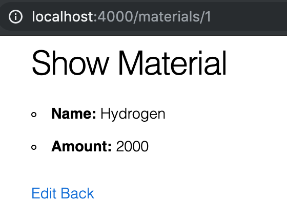
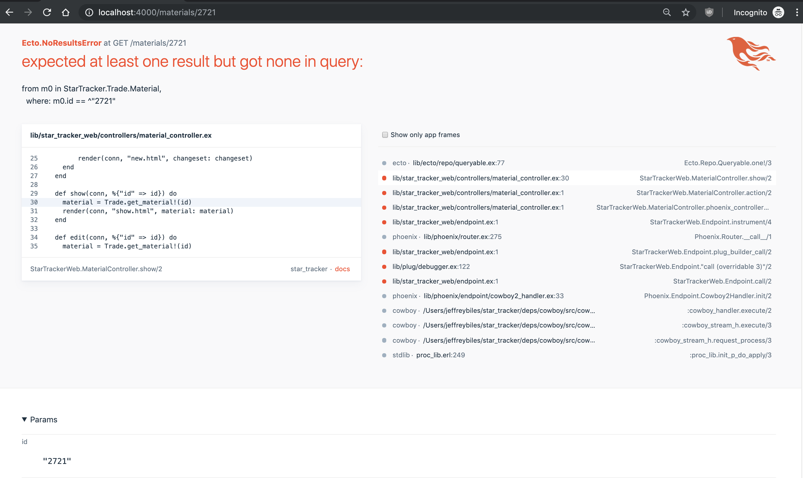
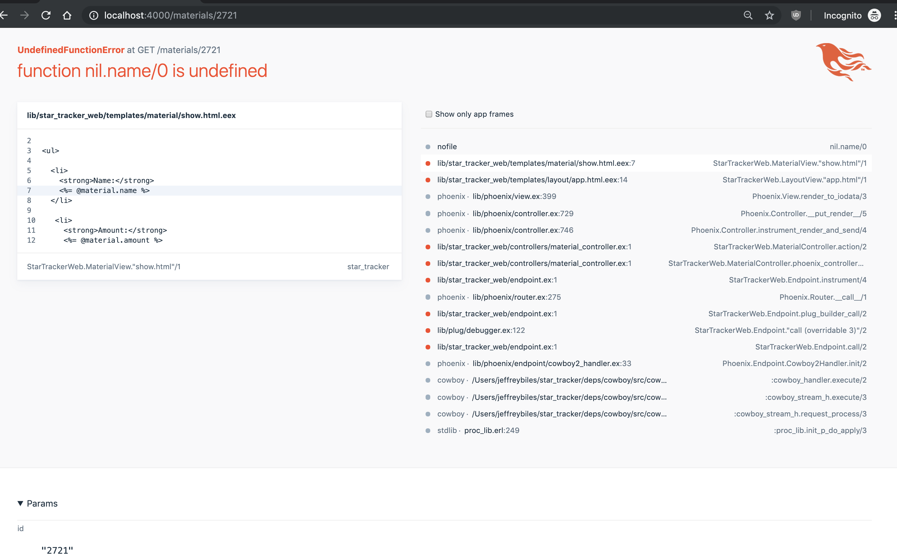

# The Material Show Page

In the last chapter we went over the Materials Index page.  We started from how the route matches a URL to a controller, then showed how the controller gets data from the database to the template, took a detour to explore the Material model, then finally went over the Embedded Elixir template.

This chapter will do the same thing for the Material Show page.  It will be shorter because the show page shares many things in common with the index page.  However, aside from the review, there are still some interesting new techniques to be learned that we'll be using throughout our Phoenix app.



## The Show Route

We have one line in our `web/router.ex` file to represent all of the Material-related routes:

```elixir
resources "/materials", MaterialController
```

This route macro could expand out to seven different routes, including the show route:

```elixir
get "/materials/:id", MaterialController, :show
```

We're matching the URL to the `show` action on the `MaterialController`, and giving it one param: `:id`.

## Pattern Matching on Map

The `show` action is as follows:

```elixir
def show(conn, %{"id" => id}) do
  material = Repo.get!(Material, id)
  render(conn, "show.html", material: material)
end
```

The first thing you may notice is how we've defined our params argument... instead of simply putting them all in `params` and pulling them out later, we're pattern-matching using `%{"id" => id}`.

There are two aspects to this.  One is simply pulling information out of the params Map, and could be replicated with the following code:

```elixir
def show(conn, params) do
  id = params["id"];
  material = Repo.get!(Material, id)
  render(conn, "show.html", material: material)
end
```

The other aspect to pattern-matching on a Map is that it will refuse to match unless the data is provided as expected.  Let's go back to our `LearningElixir` module and create a new `inspire` function:

```elixir
defmodule LearningElixir do
  def my_map do
    %{
      "name" => "Enterprise",
      "type" => "CodeShip",
      "mission" => "To explore strange new techniques, to seek out new programming languages and new web frameworks, to code boldly go where no man has gone before"
    }
  end

  def inspire(%{"name" => name, "type" => type, "mission" => mission}) do
    "These are the voyages of the #{type} #{name}.  Its five-year mission: #{mission}"
  end
end
```

Then we can run the following in the command line:

```bash
$ LearningElixir.my_map |> LearningElixir.inspire
"These are the voyages of the CodeShip Enterprise.  Its five-year mission: To explore strange new techniques, to seek out new programming languages and new web frameworks, to code boldly go where no man has gone before"
```

It automatically mapped the values in `my_map` to the arguments in `inspire`.  But what happens if we feed it a map that doesn't have all the required key-value pairs?

```bash
$ %{"name" => "Joe", "type" => "CodeShip"} |> LearningElixir.inspire
** (FunctionClauseError) no function clause matching in LearningElixir.inspire/1
    iex:10: LearningElixir.inspire(%{"name" => "Joe", "type" => "CodeShip"})
```

Pattern-matching on the keys protects the function from running unless the map that's been given to it has all the required information.  This can catch a large class of possible errors, and prevents you from having to do null checks on those keys (like you would have to do in Ruby or Javascript).

The problem here- Joe has no mission.  Hard to inspire people without a mission!

> The careful observer will note that we used Strings to match instead of atoms.  If you try to match a URL parameter with atoms, it will give the "no function clause matching" error.

## Repo.get! and exclamation point functions

Back to our `show` action:

```elixir
def show(conn, %{"id" => id}) do
  material = Repo.get!(Material, id)
  render(conn, "show.html", material: material)
end
```

The next line is about how we get the selected Material.  `Repo.get!` takes two required arguments- the record type (`Material`) and the id of the record we're trying to get.  Remember, `id` is automatically assigned when we create a record and is unique per type of record- so the two pieces of information we're giving `Repo.get!` is always enough information to uniquely identify a record.

If you look at the list of functions on `Repo`, you may notice something funny- in addition to `Repo.get!` there's also a `Repo.get` function- the same name, but without the exclamation point.  This is a shorthand adopted from Ruby; an exclamation point tells the user that the function will throw an error if doesn't work instead of failing silently.  

Let's test this out by putting in an id that we don't have yet:



What a nice error!  It points to the exact line with our failing `Repo.get!` call and gives us the information that we fed into the function.  Plenty of information to reconstruct what went wrong.

Now let's try removing the exclamation point, and see what happens if we feed in a bad ID with `Repo.get`:



What a terrible error.  "function nil.name/0 is undefined or private".  Because our app is still small, and because I have experience with errors like this, I can infer the problem is that `@material` is nil, and trace that back to where `@material` is defined- with `Repo.get`.  But that's a lot of unnecessary work, and if the app is big or you're a beginner, then it may be overwhelming.  The default- `Repo.get!`- is much better.

Anyways, back to our controller- our last line is very familiar: `render(conn, "show.html", material: material)`.  It renders the show template and feeds it the material we grabbed.

## The Show template

Here's the `show` template:

```html
<h2>Show material</h2>

<ul>

  <li>
    <strong>Name:</strong>
    <%= @material.name %>
  </li>

  <li>
    <strong>Amount:</strong>
    <%= @material.amount %>
  </li>

  <li>
    <strong>Latinum per 1k:</strong>
    <%= @material.latinum_per_1k %>
  </li>

</ul>

<%= link "Edit", to: material_path(@conn, :edit, @material) %>
<%= link "Back", to: material_path(@conn, :index) %>
```

Most of this should be review: the header (`h2`), the list (`ul` and `li`), displaying data (`<%= @material.name %>`), and creating links (`<%= link "Edit", to: material_path(@conn, :edit, @material) %>`).

The only new thing is the `<strong>` tag, and it's pretty simple- it bolds the text inside.  It is preferred to using the bold (`<b>`) tag directly because you can always redefine what the `<strong>` tag means; bolding is only a default.

## Conclusion

In addition to reviewing the core Phoenix pattern, we saw two important new techniques- exclamation point functions and pattern matching on Map keys.  You'll see both of these a lot throughout your Phoenix app and grow to appreciate their usefulness.

## Exercises

1. Add the `id` property to the top of the list, above the name.
2. Add the `updatedAt` and `createdAt` properties to the bottom of the list, below `latinum_per_1k`.
3. Make a version of the `inspire` function that doesn't require a mission.  Not very inspiring, is it?  Now make one that requires a mission but doesn't require a spaceship name or type.  Test each of them in the command line, making sure that the version with all three keys is triggered when all three keys are available, but the other two versions are triggered when keys are missing.

These are the results you should get:

```bash
$ %{"mission" => "Write awesome code"} |> LearningElixir.inspire
"Your mission: Write awesome code"
$ %{"name" => "Jeffrey", "type" => "Human"} |> LearningElixir.inspire
"These are the voyages of the Human Jeffrey."
$ %{"name" => "Jeffrey", "type" => "Human", "mission" => "Make learning programming more fun and less frustrating"} |> LearningElixir.inspire
"These are the voyages of the Human Jeffrey.  Its five-year mission: Make learning programming more fun and less frustrating"
```

Hint: the order that you have the function versions in matters.
